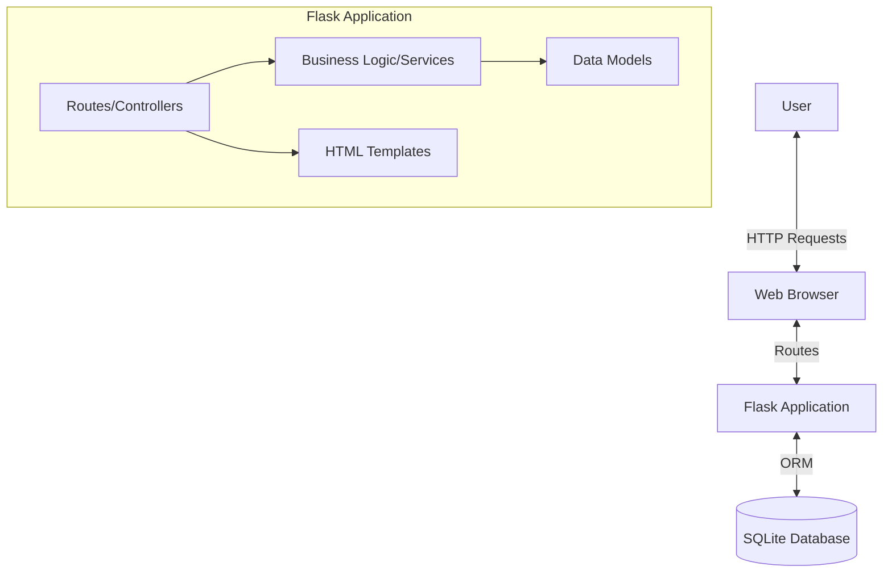

# High Level Design (HLD)

## 1. System Architecture
SmartSpend follows the **Model-View-Controller (MVC)** architectural pattern, adapted for Flask (MTV - Model-Template-View).

- **Model (Database Layer)**: Manages data logic and database interactions (SQLAlchemy).
- **View (Template Layer)**: Handles the presentation layer (Jinja2 Templates, HTML, CSS).
- **Controller (Route Layer)**: Processes user input, interacts with the model, and renders templates (Flask Routes).

### Architecture Diagram

## 2. Technology Stack

| Component | Technology | Description |
|-----------|------------|-------------|
| **Frontend** | HTML5, CSS3, JavaScript | Structure, Styling (Tailwind CSS), and Interactivity. |
| **Backend** | Python (Flask) | Web framework for handling logic and routing. |
| **Database** | SQLite | Lightweight, serverless relational database. |
| **ORM** | SQLAlchemy | Object-Relational Mapper for database abstraction. |
| **Visualization** | Chart.js | JavaScript library for rendering charts. |
| **Data Processing** | Pandas | Library for data manipulation and export. |
