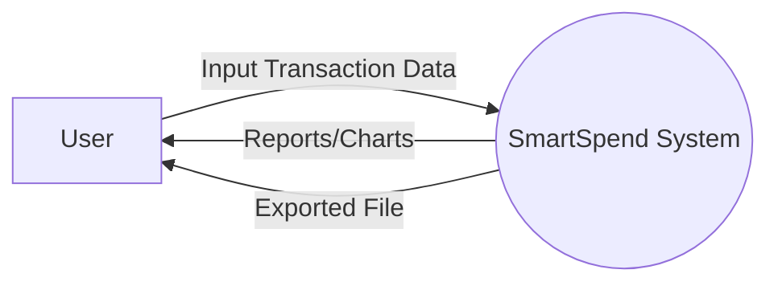
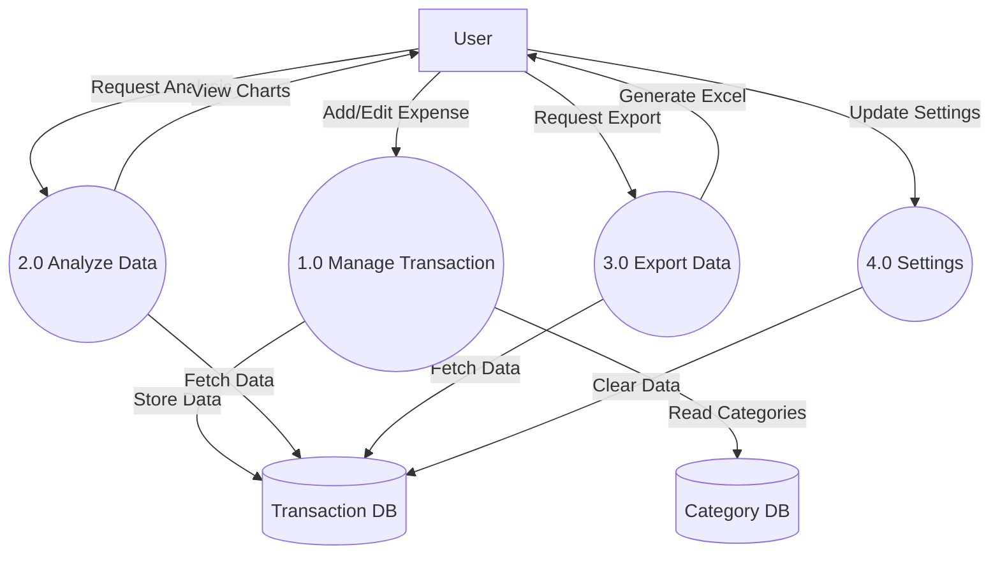
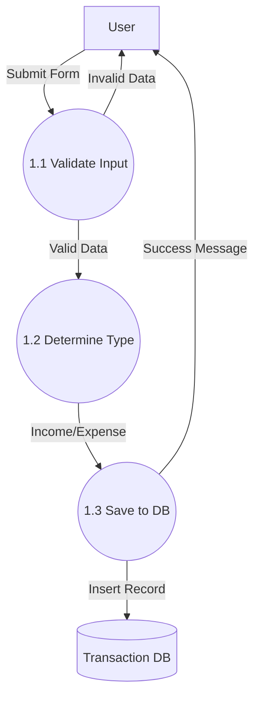

# Data Flow Diagrams (DFD)

## Level 0 DFD (Context Diagram)

```mermaid
graph LR
    User[User] -- Input Transaction Data --> System((SmartSpend System))
    System -- Reports/Charts --> User
    System -- Exported File --> User
```

## Level 1 DFD (System Overview)

```mermaid
graph TD
    User[User]
    
    P1((1.0 Manage Transaction))
    P2((2.0 Analyze Data))
    P3((3.0 Export Data))
    P4((4.0 Settings))
    
    DS1[(Transaction DB)]
    DS2[(Category DB)]
    
    User -- Add/Edit Expense --> P1
    P1 -- Store Data --> DS1
    P1 -- Read Categories --> DS2
    
    User -- Request Analysis --> P2
    P2 -- Fetch Data --> DS1
    P2 -- View Charts --> User
    
    User -- Request Export --> P3
    P3 -- Fetch Data --> DS1
    P3 -- Generate Excel --> User
    
    User -- Update Settings --> P4
    P4 -- Clear Data --> DS1
```

## Level 2 DFD (Process 1.0: Manage Transaction)

```mermaid
graph TD
    User[User]
    
    P1_1((1.1 Validate Input))
    P1_2((1.2 Determine Type))
    P1_3((1.3 Save to DB))
    
    DS1[(Transaction DB)]
    
    User -- Submit Form --> P1_1
    P1_1 -- Valid Data --> P1_2
    P1_1 -- Invalid Data --> User
    P1_2 -- Income/Expense --> P1_3
    P1_3 -- Insert Record --> DS1
    P1_3 -- Success Message --> User
```
