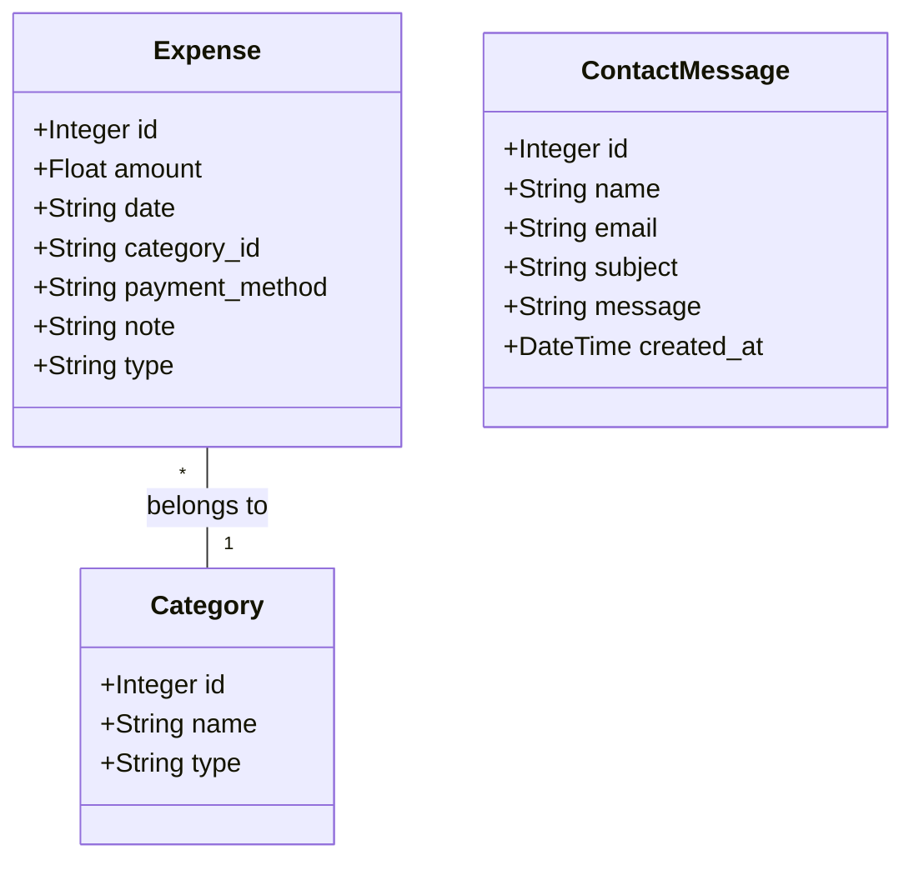
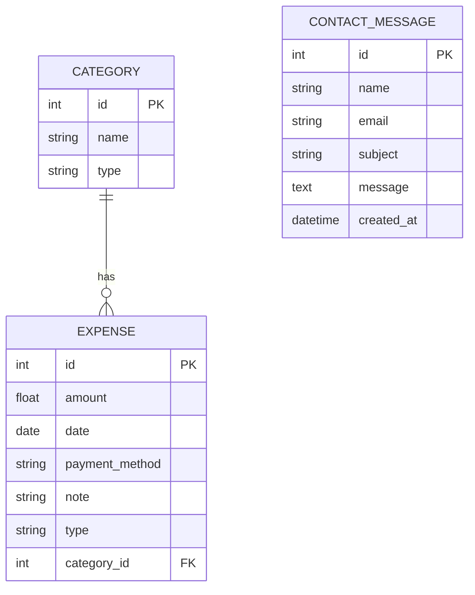
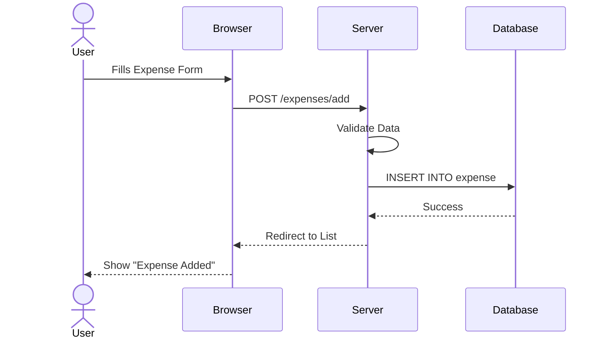
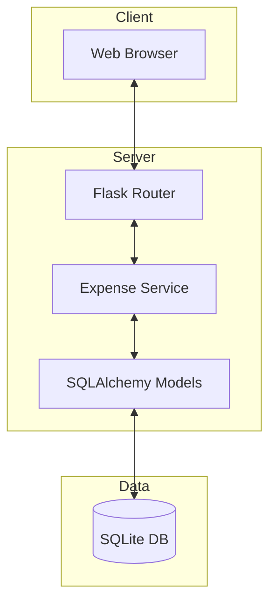
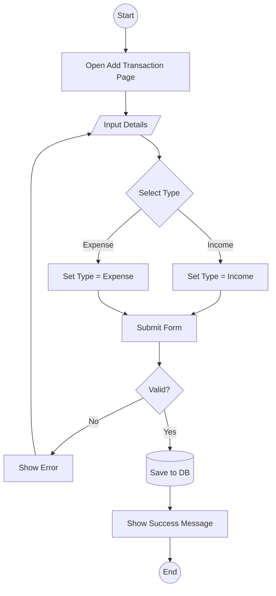
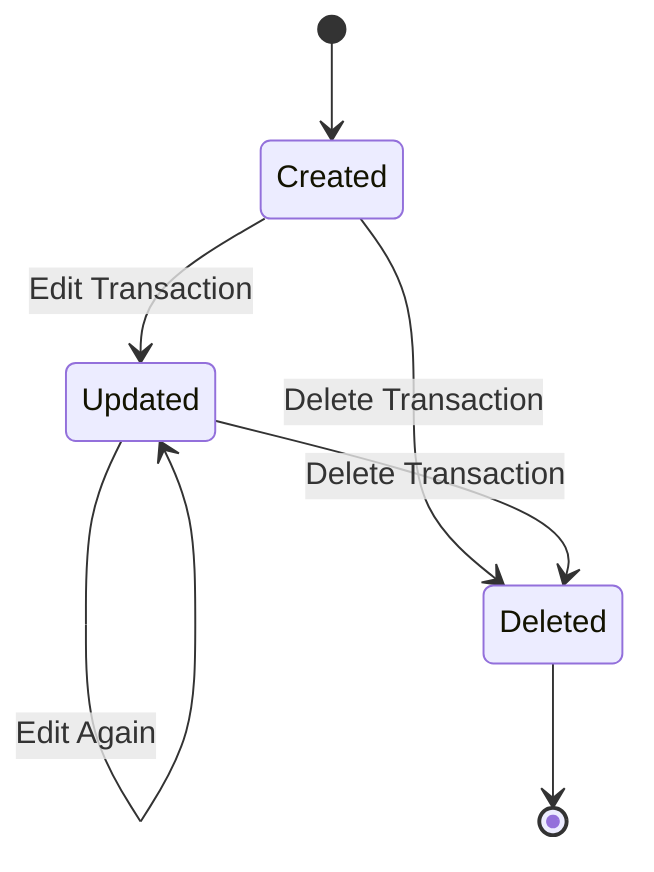

# System Design Diagrams

## 1. Class Diagram

## 2. ER Diagram (Entity-Relationship)

## 3. Sequence Diagram (Add Expense)

## 4. Component Diagram

## 5. Activity Diagram (Add Transaction)

## 6. State Transition Diagram (Expense Lifecycle)

## 7. Database Schema Design

| Table | Column | Type | Constraints | Description |
|-------|--------|------|-------------|-------------|
| **Category** | id | Integer | PK | Unique ID |
| | name | String(50) | Not Null | Category Name |
| | type | String(20) | Default 'expense' | Income/Expense |
| **Expense** | id | Integer | PK | Unique ID |
| | amount | Float | Not Null | Transaction Amount |
| | date | Date | Not Null | Transaction Date |
| | category_id | Integer | FK | Links to Category |
| | payment_method | String(50) | | Cash/Card/UPI |
| | note | String(200) | | Optional Note |
| | type | String(20) | Default 'expense' | Income/Expense |
| **ContactMessage** | id | Integer | PK | Unique ID |
| | name | String(100) | | Sender Name |
| | email | String(120) | | Sender Email |
| | subject | String(100) | | Message Subject |
| | message | Text | | Message Body |

## 8. Data Dictionary

- **Transaction**: A record of a financial exchange (Income or Expense).
- **Category**: A classification for transactions (e.g., Food, Salary).
- **Prefix Sum**: An algorithmic concept used to calculate cumulative spending over time.
- **Export**: The process of converting database records into an Excel file.

## 9. Decision Table (Transaction Validation)

| Condition | Rule 1 | Rule 2 | Rule 3 | Rule 4 |
|-----------|--------|--------|--------|--------|
| Amount > 0 | Y | N | Y | Y |
| Date Valid | Y | Y | N | Y |
| Category Selected | Y | Y | Y | N |
| **Action** | | | | |
| Save Transaction | X | | | |
| Show Error | | X | X | X |
